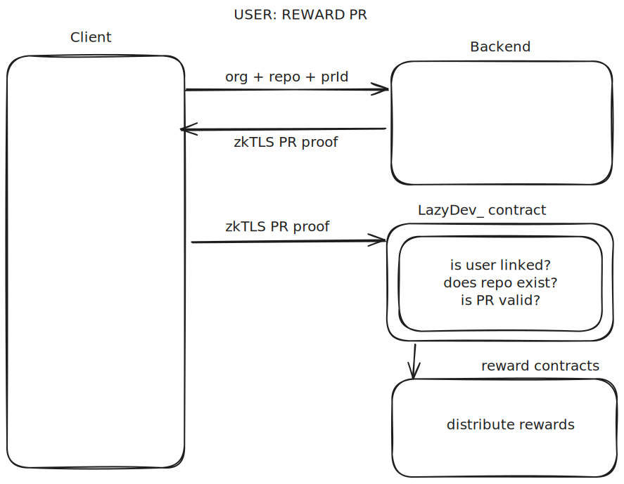

# Architecture
> \[!NOTE\]
> Before breaking down the architecture to smaller pieces we should understand that the backend is only needed because proofs can not be generated client side thus the backend is like a proxy between Reclaim zkTLS attestors and the client. Hence it doesn't harm the decentralization.  

## Repo Registration Flow

The 'admin' of the repository first authenticates through Github and get an `access token`.

To set up the project, owner need to prove their Github user and the information that shows that they are the owner of the repository. Hence, they create 2 proofs to send to the contract.

### User proof
With the access token generated by Github, they send a request to backend with the token. Backend is only used as an proof worker, so Backend sends a request to `/user` endpoint with the corresponding access token through the Reclaim Client to get the proof of the request.
> \[!NOTE\]
> Access token is passed as an private option to the client, so the Reclaim attestors does not get to see the token to protect the privacy.  
### Permission proof
Project admin then sends another request to `/repos/${repoOwner}/${repo}/collaborators/` to prove that they have 'admin' permission for the repository. That is needed by the smart contract to verify that the user is actually has permissions to set up the repository.

### Submission to the smart contract
With the proofs, repository owners then interacts with the smart contract. LazyDev_ uses commit/reveal schema to prevent front-running  as explained before.

## Developer Github Account Linking

Users needs to link their github account with their wallet adresses before claiming rewards. The process for the user is very similar to the project registration.

The user first authenticates through Github and get an `access token`.

To link the Github user with the wallet, user needs to prove their Github user and the information that shows that they are a valid github user. They create the user proof to send to the contract.

### User proof
With the access token generated by Github, they send a request to backend with the token. Backend is only used as an proof worker, so Backend sends a request to `/user` endpoint with the corresponding access token through the Reclaim Client to get the proof of the request.
> \[!NOTE\]
> Access token is passed as an private option to the client, so the Reclaim attestors does not get to see the token to protect the privacy.  

LazyDev_ is using the commit/reveal schema also for the users as explained before.
### Commit User Transaction:
The Github User Id, wallet address and the hash of a random secret is used in the first transaction. Smart contract then saves this information to compare with the data in the second transaction.

### Link Account Transaction
The user proof, wallet address and the secret itself is used in this transaction. Contract first verifies the zkTLS proof, then compare the secret to the earlier commitment key(hash of the string). if everything is valid, Github user id and the wallet address is linked.

## Reward Distribution Flow

To claim a reward, user must be registered in the smart contract as explained before

zkTLS proof of the pull request data is needed by the contract to ensure that the user is actually opened a PR and it is merged. Backend creates the pull request proof and returns it to the user.

Now user can interact with the smart contract sending the proof. If the proof is valid, smart contract checks the labels of the PR, and trigger the corresponding reward contracts linked with the labels to distribute the reward.

